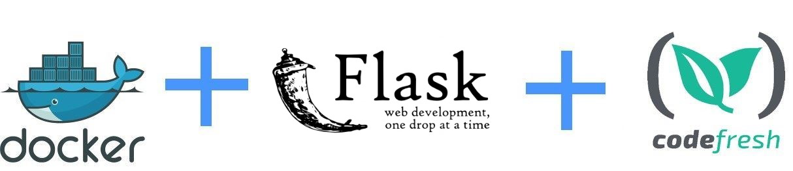

## Flaskr an example application written in Python/Flask

Original source code from https://github.com/pallets/flask/tree/master/examples/tutorial

## Docker instructions

To create a docker image execute: 

`...........`

To run the docker image execute:

`...........`

To run unit tests inside the container execute:

`...........`

and then in the new command promt run

`...........`

## To use this project in Codefresh

There is also a [codefresh.yml](codefresh.yml) for easy usage with the [Codefresh](codefresh.io) CI/CD platform.

More details can be found in [Codefresh documentation](https://codefresh.io/docs/docs/getting-started/create-a-basic-pipeline/)
